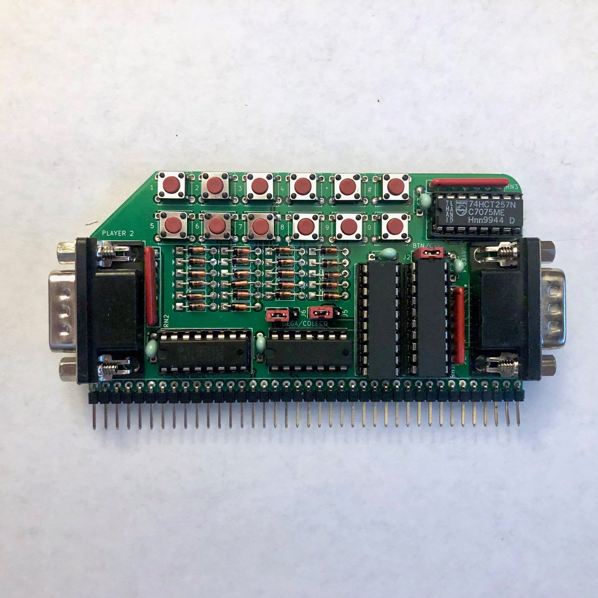

# Game Controller Board for RC2014

This board provides a DB-9 game controller interface compatible with Atari Joysticks, Sega Genesis controllers, and ColecoVision controllers.  It uses the same I/O ports as the ColecoVision so it is [compatible with unmodified ColecoVision games](https://hackaday.io/project/159057-game-boards-for-rc2014/log/156298-running-colecovision-games).

This board is based on the schematics I found for the ColecoVision and its controller, linked below.

## Assembly Instructions

[Ready-to-Assemble Kits](https://www.tindie.com/products/mfkamprath/game-controller-card-kit-for-rc2014/) are available on Tindie.  These are sold by Michael Kamprath with my permission.  However, I offer no warranty or guarantee of support.

[REV2 Gerbers](https://cdn.hackaday.io/files/1590576805094688/GameController_rev2_gerber.zip) for the PCB are available. I highly recommend [JLCPCB](https://jlcpcb.com/) for PCB fabrication. Alternatively, boards can be ordered from the shared project on [OSH Park](https://oshpark.com/shared_projects/jN9CSUPb).

Refer to the [schematic](GameControl.pdf), the picture below, and the bill of materials below for assembly guidance.



### Bill of Materials

| Reference | Part |
|-|-|
| J1 | 1x40 right angle pin header |
| J2, J5, J6 | 1x3 straight pin header |
| | Jumper blocks for J2, J5, and J6 |
| J3, J4 | Norcomp 182-009-113R562 male DB-9 connector |
| C1-C7 | 0.1uf disc or MLCC capacitors |
| D1 - D22 | 1N4148 diodes |
| RN1, RN2, RN3 | Bussed 10K SIP 6 resistor network (Bourns 4607X-101-103LF or similar)|
| SW1 - SW12 | 4-pin tactile pushbuttons (KSL0Axxx1LFTR or similar) |
| U2 | 74HCT138 3-8 line decoder | 
| U3 | 74HCT00 quad 2-input NAND gate |
| U4, U5 | 74HCT541 tri-state octal buffer |
| U6 | 74HCT257 quad 2-input mux |

If you don't need Player 2 input, then the second 74HCT541 and DB-9 connector can be omitted.

If you don't want to play ColecoVision games with Sega or Atari controllers, D1-D22 and SW1-SW12 can be omitted.

## Controller Compatibility Modes

The Atari joystick, ColecoVision controllers, and Sega Genesis gamepads all share the same basic DB-9 pinout, but the Genesis and ColecoVision expand on the standard set by Atari in different, incompatible ways.  `J5` and `J6` select between Sega and Coleco controller modes.  Both jumpers must be set to either Sega mode (left position) or Coleco mode (right position).  Atari joysticks will work in either mode.  Because Coleco mode switches the polarity of the power supply, it's possible Sega controllers could be damaged if connected in this mode, so be careful!

## Numeric Keypad Buttons

ColecoVision controllers had a numeric keypad laid out like a touch-tone phone.  Most ColecoVision games require the keypad to select a skill level before you can start them.  To support these games when using a Sega controller or Atari joystick, I have put buttons on the board itself that emulate the ColecoVision keypad.  There are two rows of buttons laid out as follows:

```
1 2 3 4 * #
5 6 7 8 9 0
```

Besides the skill level select, most games only use the keypad for things like pause and restart, so not having them on the controller is not usually a big hardship. 

`J2` selects between keypad input using the on-board buttons (left position) and pass-through from the controller (right position). On-board buttons should be enabled if you want to use Sega or Atari controllers with ColecoVision games.  Pass-through mode should be enabled when using actual ColecoVision controllers or if you want to use a 6-button Sega controller with software that supports it directly. When using non-ColecoVision controllers in passthrough mode, pressing two directions at once may be erroneously interpreted as keypad input by ColecoVision games.

On REV2 boards, `J2` only affects Player 1 input, while Player 2 input is always passed through directly from the controller.  On REV3 boards, the onboard buttons are used for both Player 1 and Player 2 when `J2` is not in passthrough mode. 

## Ports

The board uses the standard ColecoVision I/O ports:

- A write to port 80 will select keypad input and the secondary trigger (A on the Genesis controller). The value written is unimportant.
- A write to port C0 will select directional input and the primary trigger (B on the Genesis controller). The value written is unimportant.
- A read from port FC will read the status of the currently selected buttons on Player 1's controller.
- A read from port FF will read the status of the currently selected buttons on Player 2's controller. 

 For more information on how to interpret the values returned, refer to [ColecoVision Programming Info](http://www.atarihq.com/danb/files/CV-Tech.txt) and [How to Read Sega Controllers](https://github.com/jonthysell/SegaController/wiki/How-To-Read-Sega-Controllers).

The address lines are not fully decoded, so actually the entire range of ports 80-9F, C0-DF, and E0-FF are used by the board. In range E0-FF, addresses with the A1 line low (e.g., FC or ED) correspond to player 1, and addresses with the A1 line high (e.g., FF or EE) correspond to player 2. This is the same as on the original ColecoVision. It's possible that some games may use non-standard ports in these ranges.

Since ports in the 80-9F or C0-DF range are write-only, it should not matter if there is a conflict with other boards using the same ports, since no bus contention will occur.  Writing to ports for other boards in these ranges will switch the controller mode, but unless you're actually using the controller, it won't matter. However, be careful if you have any boards that use addresses in range E0-FF since reading from an address in this range could lead to bus contention when both boards respond.

## References

- [Example Code](examples)
- [Instructions for running ColecoVision Games](https://hackaday.io/project/159057-game-boards-for-rc2014/log/156298-running-colecovision-games)
- [ColecoVision Schematics](http://www.atarihq.com/danb/files/colecovision.pdf)
- [ColecoVision Controller Schematics](http://www.chromesphere.net/coleco/Documents/ColecoController.pdf)
- [ColecoVision Programming Info](http://www.atarihq.com/danb/files/CV-Tech.txt)
- [How to Read Sega Controllers](https://github.com/jonthysell/SegaController/wiki/How-To-Read-Sega-Controllers)

## Other Boards

- [TMS9918A Video Card](https://github.com/jblang/rc9918): my TMS9918A video card for the RC2014
- [SN76489 Sound Card](https://github.com/jblang/SN76489): my SN76489 sound card for the RC2014
- [z80ctrl](https://github.com/jblang/z80ctrl): my AVR-based bus monitor and bootloader board for the RC2014

## License

Copyright 2018-2020 J.B. Langston

Permission is hereby granted, free of charge, to any person obtaining a copy of this software and associated documentation files (the "Software"), to deal in the Software without restriction, including without limitation the rights to use, copy, modify, merge, publish, distribute, sublicense, and/or sell copies of the Software, and to permit persons to whom the Software is furnished to do so, subject to the following conditions:

The above copyright notice and this permission notice shall be included in all copies or substantial portions of the Software.

THE SOFTWARE IS PROVIDED "AS IS", WITHOUT WARRANTY OF ANY KIND, EXPRESS OR IMPLIED, INCLUDING BUT NOT LIMITED TO THE WARRANTIES OF MERCHANTABILITY, FITNESS FOR A PARTICULAR PURPOSE AND NONINFRINGEMENT. IN NO EVENT SHALL THE AUTHORS OR COPYRIGHT HOLDERS BE LIABLE FOR ANY CLAIM, DAMAGES OR OTHER LIABILITY, WHETHER IN AN ACTION OF CONTRACT, TORT OR OTHERWISE, ARISING FROM, OUT OF OR IN CONNECTION WITH THE SOFTWARE OR THE USE OR OTHER DEALINGS IN THE SOFTWARE.
